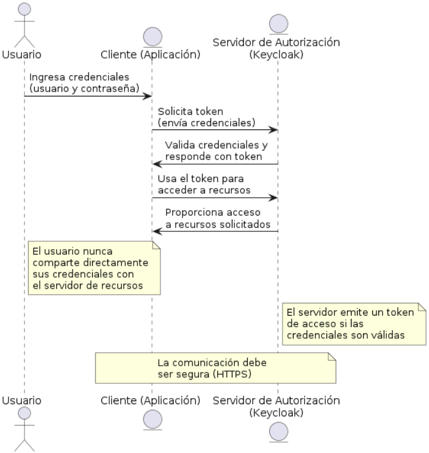
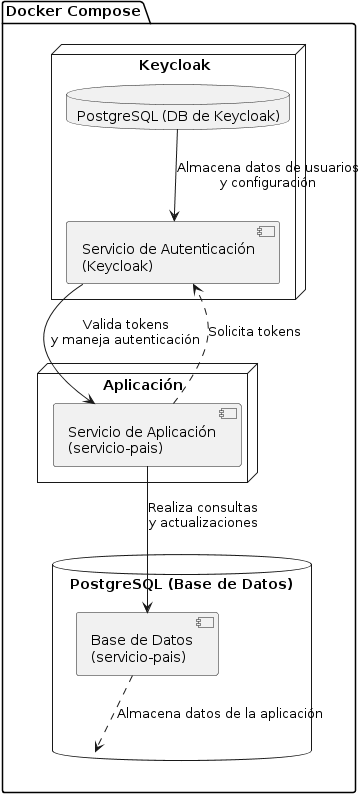

# Autorización y Autenticación con OAuth2 y JWT

## Introducción

Este proyecto implementa un sistema de autorización y autenticación utilizando el protocolo OAuth2 con tokens JWT (JSON Web Tokens). OAuth2 es un estándar de la industria que permite implementar flujos seguros de autorización, mientras que JWT es un estándar basado en JSON para la creación de tokens de acceso que permiten la propagación de identidad y privilegios.

## OAuth2



OAuth2 es un marco de autorización que permite a las aplicaciones obtener acceso limitado a cuentas de usuario en un servidor HTTP. Se utiliza para proporcionar un flujo de autenticación segura, definiendo varios roles como Cliente, Propietario del Recurso, Servidor de Autorización y Servidor de Recursos.

Los clientes pueden solicitar tokens de acceso, que les permiten acceder a recursos protegidos en el servidor de recursos. Este proceso se lleva a cabo sin exponer las credenciales del usuario final, asegurando que la información sensible se mantenga protegida.

## JWT

JWT es un medio compacto y seguro de usar en HTTP para representar afirmaciones que se pueden intercambiar entre dos partes. Los tokens JWT contienen declaraciones que son codificadas y posiblemente encriptadas. Después de la autenticación, el servidor emite un token JWT que el cliente utiliza para acceder a los recursos protegidos durante el período de validez del token.

Un token JWT típicamente incluye una cabecera, un cuerpo con las declaraciones y una firma. La cabecera contiene el tipo de token y el algoritmo de cifrado, el cuerpo incluye la información del usuario y metadata, y la firma asegura que el token no haya sido alterado.

## Implementación en el Proyecto

El proyecto configura un servidor de autorización que utiliza JWT para emitir tokens a los clientes. Se implementa el flujo de "Password Credentials", donde el usuario final proporciona su nombre de usuario y contraseña directamente al cliente, que luego los envía al servidor de autorización para obtener un token.

### Componentes Principales

- **Servidor de Autorización**: Gestiona las solicitudes de tokens basadas en las credenciales del cliente y el usuario.
- **Servidor de Recursos**: Protege los recursos, requiriendo tokens de acceso válidos para permitir las solicitudes.
- **Cliente**: Una aplicación que solicita tokens al servidor de autorización y accede a recursos en el servidor de recursos.

### Seguridad

La seguridad es implementada utilizando protocolos estándar y librerías que soportan OAuth2 y JWT. Se asegura que los tokens sean emitidos únicamente a clientes autenticados y que los recursos solo sean accesibles con tokens válidos.


## Keycloak

### Keycloak Configuration

**Keycloak** es una solución de gestión de identidades y accesos, utilizada para la autenticación y autorización en aplicaciones modernas. En este proyecto, Keycloak se configura como parte del stack de servicios en Docker Compose.

#### Despliegue de Keycloak

El servicio de Keycloak se despliega utilizando Docker y se configura para operar en modo de desarrollo, lo que es ideal para pruebas y no debe utilizarse en un entorno de producción.

**Docker Compose Configuración para Keycloak:**
```yaml
keycloak:
  image: 'quay.io/keycloak/keycloak:latest'
  entrypoint: ["/opt/keycloak/bin/kc.sh"]
  command: ["start-dev"]
  environment:
    KC_DB: postgres
    KC_DB_URL: jdbc:postgresql://db2/keycloak
    KC_DB_USERNAME: keycloak
    KC_DB_PASSWORD: password
    KC_HOSTNAME: localhost
    KC_HEALTH_ENABLED: true
    KC_METRICS_ENABLED: true
    KEYCLOAK_ADMIN: admin
    KEYCLOAK_ADMIN_PASSWORD: admin
  ports:
    - '8080:8080'
  depends_on:
    - db2
  networks:
    - red-backend-app
```

#### Acceso a Keycloak

Para acceder a la consola de administración de Keycloak, use la siguiente URL una vez que el servicio esté en funcionamiento:

```
http://localhost:8080
```

Las credenciales por defecto para el administrador son:
- **Usuario:** admin
- **Contraseña:** admin

Estas credenciales pueden y deben ser cambiadas en entornos de producción para garantizar la seguridad.

#### Integración con aplicaciones

Keycloak se configura para interactuar con otras aplicaciones y servicios a través de OAuth2 y OpenID Connect. Las aplicaciones pueden autenticar usuarios y autorizar accesos utilizando los tokens JWT emitidos por Keycloak.

**Variables de Entorno Relevantes:**
- `KEYCLOAK_URL`: URL de acceso a Keycloak, utilizado por otras aplicaciones para autenticación.
- `KC_DB_URL`: URL de la base de datos donde Keycloak almacena datos de configuración y estado.

Estas configuraciones permiten que Keycloak funcione de manera integrada dentro del entorno de desarrollo, facilitando la gestión de autenticaciones y autorizaciones en un microservicio o arquitectura orientada a servicios.

## Estructura de los servicios



## Instrucciones de Ejecución con Docker Compose

Para ejecutar esta aplicación utilizando Docker Compose, sigue estos pasos:

### Prerrequisitos

Asegúrate de tener Docker y Docker Compose instalados en tu sistema. Puedes descargarlos e instalarlos desde [Docker Hub](https://docs.docker.com/get-docker/) y [Docker Compose](https://docs.docker.com/compose/install/), respectivamente.

### Clonar el Repositorio

Primero, clona el repositorio en tu máquina local usando:

```bash
git clone https://github.com/alvaro-salazar/servicio-pais
cd servicio-pais
```

### Ejecutar Docker Compose

Para iniciar todos los servicios definidos en tu archivo `compose.yaml`, ejecuta el siguiente comando en la terminal:

```bash
docker compose up
```

Este comando construirá las imágenes si es la primera vez que se ejecutan, y luego iniciará los contenedores.

### Verificar la Ejecución

Una vez que los contenedores estén en ejecución, podrás acceder a la aplicación a través de la dirección URL configurada.
Keycloak: `http://localhost:8080`.
Pais Service: `http://localhost:8081`.

### Detener la Aplicación

Para detener todos los contenedores y eliminar los contenedores, las redes, los volúmenes y las imágenes creadas por `docker compose up`, puedes usar:

```bash
docker compose down
```

## Pruebas con Postman

Este repositorio incluye dos archivos JSON para su uso con Postman:

- `Keycloak.postman_collection.json`: Contiene las peticiones preconfiguradas para interactuar con la API.
- `variables.postman_environment.json`: Define las variables de entorno necesarias para las peticiones en Postman.

### Importar la Colección y las Variables de Entorno en Postman

Para importar estos archivos en Postman, sigue estos pasos:

1. Abre Postman.
2. Haz clic en el botón "Import" en la esquina superior izquierda.
3. Selecciona "File" y luego "Upload Files".
4. Busca y selecciona los archivos `Keycloak.postman_collection.json` y `variables.postman_environment.json` desde tu computador.
5. Haz clic en "Import" para añadirlos a tu entorno Postman (A collection y a Enviroment respectivamente).

Una vez importados, podrás ver la colección de peticiones en la barra lateral izquierda y las variables de entorno bajo la sección "Environment" en la esquina superior derecha de Postman.
Recuerda que debes configurar las variables de entorno con los valores correctos para tu entorno de desarrollo. Tambien debes seleccionar el environment correcto en Postman para que las variables de entorno se apliquen correctamente.

### Utilizar las Peticiones de Prueba

Selecciona la colección importada en Postman para acceder a las diferentes peticiones configuradas. Asegúrate de tener seleccionado el entorno correcto en Postman para que las variables de entorno se apliquen correctamente.

Estas peticiones te permitirán probar las funcionalidades de la API, como la autenticación, la creación de recursos, la lectura de datos, entre otros.